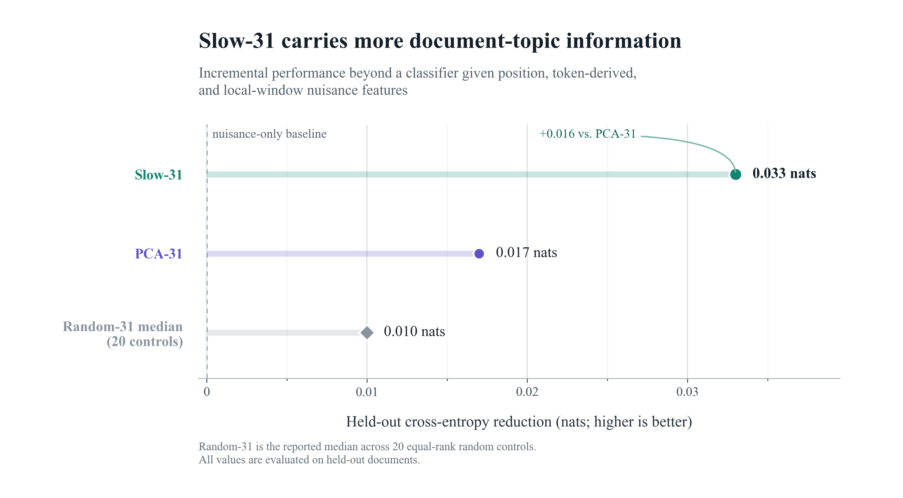

::: {.hero-grid}
::: {.hero-copy}
## Residual streams have a geometry of time

Most directions in a transformer's residual stream lose predictive structure within one token. A compact 31-dimensional subspace remains correlated across much longer spans.

[Read the experiment](research/residual-stream-geometry.qmd){.primary-button} [Technical appendix](research/appendix.qmd){.secondary-button}
:::

::: {.hero-figure}

:::
:::

## Main results

::: {.result-grid}
::: {.result-card}
### 31 directions

carry about 80% of the measured timescale excess while behaving like roughly 28 independent geometric directions.
:::

::: {.result-card}
### 25 tokens

is the median timescale of generic directions sampled inside the slow span, compared with 1–1.5 tokens for matched PCA controls.
:::

::: {.result-card}
### 0.033 nats

of held-out topic-prediction gain comes from Slow-31 beyond local nuisance features, beating PCA-31 and all 20 frozen random controls.
:::
:::

## Updated semantic audit

The new supervised analysis treats the slow subspace as frozen and asks whether it adds document-topic information beyond token position, token-derived features, and local-window embeddings. Slow-31 provides about 1.93 times the gain of PCA-31 despite capturing substantially less residual energy. Register remains inconclusive.

{fig-alt="Slow-31 gives a cross-entropy reduction of 0.033 nats, compared with 0.017 for PCA-31 and a random-control median of 0.010."}

[Read the supervised semantic audit](research/appendix.qmd#appendix-d-supervised-semantic-audit){.text-link}

## About

I am an undergraduate at the University of Chicago working on mechanistic interpretability. You can reach me at [fx.odenthal@gmail.com](mailto:fx.odenthal@gmail.com).
