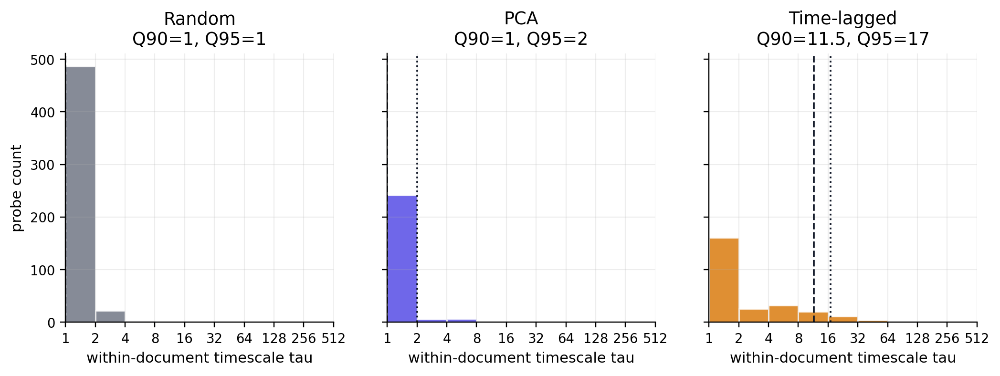
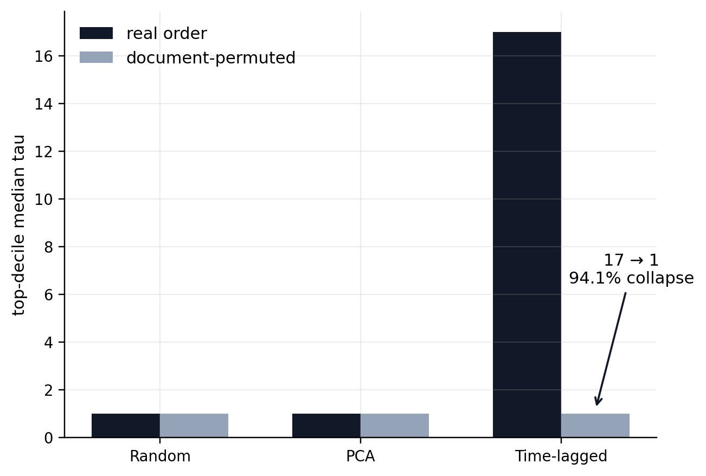
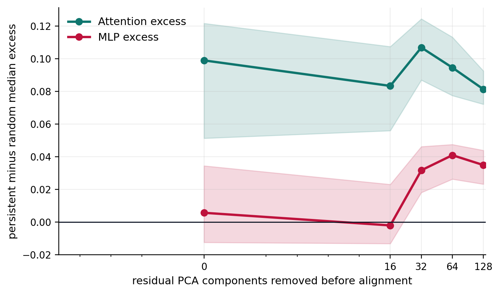
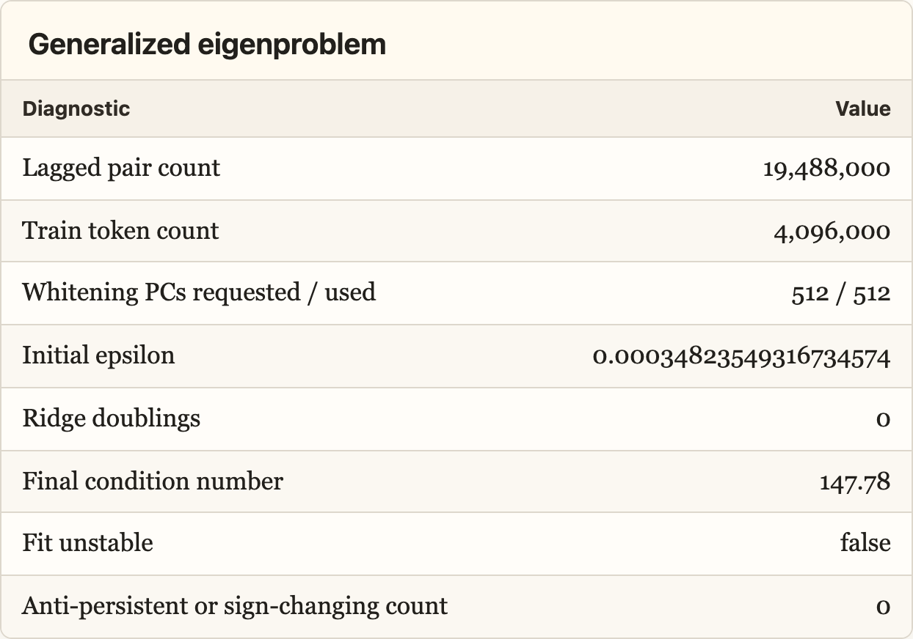

# The Residual Stream Has a Geometry of Time

## Preface

This is a preliminary writeup for an experiment on residual stream geometry. The research direction seems pretty underexplored, so I’m posting early to collect objections, research intuitions, and connections to problems other people are thinking about before I invest in the larger run.

*The case for skimming this post:* this pilot suggests we may be in a world where transformers keep track of context in a surprisingly compact way. Information that persists across many tokens is not diffuse across activation space; it concentrates into a low-dimensional geometric structure that can be projected out, compared to attention/MLP writes, and potentially targeted by interventions.

## Summary

- The residual stream is commonly analogized to the transformer's "working memory": at each token position, a high-dimensional vector accumulates the attention and MLP deltas. This picture considers state transformations along the depth-time axis, i.e. layer by layer.

- There is a second axis of sequence-time. Within a layer, the model must also keep track of information at position $t$ which is useful at position $t + k$. This experiment aims to discover the geometry of how the model tracks state across tokens.

- A direction's sequence-timescale $\tau_j$ is the lag at which its sample autocorrelation first drops below $1/e \approx 0.37$. To calculate $\tau_j$ for direction $v_j$, I project the residual stream onto $\hat v_j$ at every token position, compute within-document autocorrelation curves, average them over documents to obtain $R_j(k)$, and set $\tau_j = \min\{k \geq 1 : R_j(k) < 1/e\}$. Estimator details are in Appendix A.

- The experiment compares three probe families: 512 random directions (null baseline, no optimization), 256 PCA directions (high variance), and 256 time-lagged probes (maximize lagged covariance relative to zero-lag variance).

- I estimated the distribution of timescales across residual-stream directions in layer 12 of Gemma-2-2B on 5,000 C4 documents, then investigated the properties of the high-$\tau$ directions: where they live in the ambient space, how many there are, what they appear to semantically encode, and whether their long life is tied to sequential context or just unigram statistics.

## What I Found

**Finding 1: The timescale distribution is extremely heavy-tailed.** Random and PCA directions have a 90th-percentile timescale of 1 token, carrying essentially no signal across positions. Time-lagged probes have a 90th-percentile timescale of 17 tokens vs. a baseline of 1.



**Finding 2: State timescale is not a corpus artifact.** Shuffling token positions within documents, which preserves the token multiset but destroys sequential order, collapses the top-decile timescale of high-persistence probes from 17 tokens to 1 (94% reduction).

Because shuffling preserves each document's token multiset, this rules out an
explanation based only on document-level topic, vocabulary, or unigram composition:
the long timescales depend on ordered sequential structure.



**Finding 3: Long-lived directions are hidden inside the high-variance PCA span.** They don't sit in a quiet low-variance corner of the residual stream. Rather, they are rotations inside the high-variance subspace, but are not PCA components themselves.

**Finding 4: Long-lived signal concentrates in roughly 31 nonredundant directions, not the full ambient space.** Define a direction's timescale excess as its sequence-timescale above the random-direction median:

$$
\Delta \tau_j
=
\max\left(
\tau_j - \operatorname{median}_{u \in \mathrm{random}}\tau_u,
0
\right).
$$

Let $\Delta \tau_{(1)} \geq \Delta \tau_{(2)} \geq \cdots \geq \Delta \tau_{(1024)}$ be the sorted timescale excesses across the deduplicated eligible probe set. In this pilot,

$$
\frac{
\sum_{i=1}^{31} \Delta \tau_{(i)}
}{
\sum_{i=1}^{1024} \Delta \tau_{(i)}
}
\approx 0.8.
$$

So 31 nonredundant directions account for roughly 80% of total timescale excess. These directions are distinct from one another: median pairwise absolute cosine similarity is $0.035$, and effective rank is $28/31$. For scale, if $u, v \sim \mathrm{Unif}(S^{2303})$ are independent random unit vectors in $\mathbb{R}^{2304}$, then

$$
\mathbb{E}[\langle u, v\rangle] = 0,
\qquad
\operatorname{sd}(\langle u, v\rangle) = \frac{1}{\sqrt{2304}} \approx 0.0208.
$$

So the observed median pairwise absolute cosine is only about 1.7x the random-cosine SD.

### Held-out projection collapse

The central projection-collapse test asks whether the persistent directions are isolated probes or whether a compact recovered basis captures persistent signal from independently fit held-out probes.

I built a basis from the top high-timescale directions, projected that basis out of the residual stream, and then recomputed timescales. The anti-circularity comes from the train split. Candidate time-lagged probes used to build the projected basis were fit on one train shard, while the held-out time-lagged evaluation probes were fit independently on a disjoint train shard. Both were then evaluated on the same validation/test documents before and after projection.


I compared three matched $k$-dimensional projections: the discovered persistent-direction basis, the top residual PCA basis, and a random orthonormal control basis. Random projection tests whether deleting any $k$ dimensions would reduce persistence. PCA projection tests whether the persistent subspace is contained in generic high-variance residual geometry.

Random projection barely affected held-out persistence, while the persistent-direction and PCA projections almost completely removed it. On test at $k=256$, held-out time-lagged collapse was $1.000$ for the persistent-direction basis, $0.998$ for PCA, and $0.097$ for random control.

This suggests that the recovered basis captures held-out-generalizing persistent signal rather than merely a few selected probes. It does **not** yet show that a generic random direction inside the headline top-31 span is slow. That requires a random-in-span diagnostic: sample arbitrary rotations inside the recovered span and recompute their held-out timescales. The key established caveat is that the captured geometry is PCA-contained: individual PCA axes are mostly short-lived, but the persistent rotations live inside the high-variance PCA span.

### Attention-specific geometry after controlling for residual PCA

**Finding 5: Persistent directions are attention-specific rotations inside the high-variance residual span.** The section asks what distinguishes the persistent rotations inside that span from ordinary high-variance PCA directions.

Because the persistent subspace is PCA-contained, raw overlap with attention outputs is not enough. Attention block outputs also live in the residual stream, and may share generic high-variance geometry with residual PCA.

To control for this, I compare each direction's projection onto attention, MLP, and residual PCA subspaces of the same dimension. For a unit direction $v$ and a subspace projection matrix $P$, the overlap score is:

$$
B_P(v) = \|Pv\|_2.
$$

I define excess attention and MLP overlap as:

$$
E_{\mathrm{attn}}(v)
=
B_{\mathrm{attn}}(v)
-
B_{\mathrm{resid}}(v),
$$

$$
E_{\mathrm{MLP}}(v)
=
B_{\mathrm{MLP}}(v)
-
B_{\mathrm{resid}}(v).
$$

So positive excess means that a direction has more overlap with the attention or MLP output subspace than with a matched residual PCA subspace of the same dimension.



At the max-over-layers level, persistent top-31 directions have median attention excess $+0.1164$. Random directions have mean attention excess $0.0206$, median $0.0193$, and standard deviation $0.0166$. On this empirical random-direction scale,

$$
\frac{0.1164 - 0.0206}{0.0166} \approx 5.76.
$$

So the persistent directions are aligned with attention outputs at about 5.8 random-control SDs above the random mean.

The PCA stress test makes the same point from the opposite direction. Top residual PCs have higher raw attention overlap than persistent directions, but they have median $\tau = 1$ and median attention excess $-0.3991$. On the same random-control scale,

$$
\frac{-0.3991 - 0.0206}{0.0166}
\approx
-25.24.
$$

I do not interpret this as evidence that PCA directions are "anti-attention." It is partly mechanical: these directions are themselves residual PCA axes, so the matched residual-PCA overlap term is extremely large. The point of the comparison is narrower. Top PCA directions can have high raw attention overlap, but once generic residual PCA geometry is subtracted, they have no attention-specific excess. Persistent directions do.

There is also a weaker late-MLP signal after stronger residual-PCA controls, but attention is the primary and more robust geometry signal.

This test proves correlation, not causation, as it asks whether long-timescale residual directions lie unusually close to the attention/MLP output subspaces. It does not prove that those heads route, refresh, or causally maintain the persistent state.

**Exploratory: Semantic labels for persistent directions.**

### Semantic labels, exploratory


To get a rough semantic readout of each persistent direction, I looked at validation-set spans where that direction had unusually high or low scalar projection. These labels are not trained classifiers and are not claim-level evidence. They are qualitative summaries of examples from the tails of $v^\top r_{d,t}$.

The directions do not look like single-topic features. They look more like persistent document-state, register, domain, and source-template axes: technical/instructional prose, legal/privacy boilerplate, SEO/product/catalog repetition, numeric/table/reference structure, biomedical/scientific citation style, narrative/personal/devotional prose, recipes, and noisy scraped-template text.

---

## Potential Interpretability Benefits

*Do not want to overclaim here. This is heavily contingent on the subspace geometry and causal role holding across distributions, layers, and models, which has not been tested yet. The optimistic version is that the rank generalizes across these axes while specific directions vary. The C4 result is mild evidence for the distribution axis, as it spans a wide range of topics, registers, and domains, yet something in the model's weights organized the persistent signal into a low-dimensional structure regardless of what the tokens were about.*

The interpretability implications are speculative, as the current evidence is limited to one model, layer, corpus, and estimator. The optimistic version is not that these exact directions are universal, but that transformer residual streams may in general contain a stable low-dimensional timescale geometry while the basis varies across models or distributions.

- The two words in "mechanistic interpretability" pull in opposite directions. Mechanistic commits you to the model's actual internal operations, however alien, while interpretable commits you to human-legible semantics. The field exists on the premise that these two constraints have a joint solution.

- The timescale axis is one place they meet. It is measured in the model's native geometry, but the directions it surfaces are natural candidates for the semantic variables we most want to find like entities, topics, discourse state, goals, reasoning state, etc.

- This mirrors human cognition, where our working memory contains the variables most causally upstream of the model's behavior. A variable/direction that persists across many token positions is, by definition, one that conditions future computation across those positions.

- That reach is wider than it first appears. A persistent direction at the final token position has a direct path to the output: it is what the unembedding matrix reads. A transient direction mid-sequence can only influence future outputs indirectly, through whatever attention heads happen to read it before it decays.

- And because generated tokens are appended back into context, a direction that shapes the output at one step can persist into the next, compounding across an entire generation. A transient feature explains a local prediction; a persistent one can shape a whole reasoning chain. This extends to every unit of analysis mech interp cares about: anything that reads from or writes to the residual stream has a timescale structure.

---

## Specific Applications

**Application 1: Model components can be decomposed into a persistent component and a transient component.** If there exists a persistent residual subspace, every attention or MLP weight matrix that reads from or writes to the residual stream can be split into persistent and transient parts, e.g. PW versus (I−P)W.

**Application 2: Steering interventions become more targeted.** If a steering vector "makes the model more honest," we could test whether it works by modifying the model's persistent discourse representation (what kind of conversation the model takes itself to be in) or by adding a local logit-level bias that nudges each token slightly toward honest-sounding completions. Only the former is actually changing maintained state.

**Application 3: The KV cache may expose how persistent state is routed.** Keys and values that attract long-range attention may preferentially encode persistent directions. Testing this would connect residual-stream geometry to attention, the model's mechanism of moving information across positions.

---

## Appendix A: Time-lagged probe estimator

Let $r_{d,t}^{(\ell)} \in \mathbb{R}^{d_{\mathrm{model}}}$ be the residual stream for document $d$, token $t$, and hook layer $\ell$. Train-token centering uses

$$
\mu = \mathbb{E}_{d,t \in \mathrm{train}}[r_{d,t}^{(\ell)}],
\qquad
\bar r_{d,t} = r_{d,t}^{(\ell)} - \mu.
$$

Validation/test tokens are not used to fit PCA directions, time-lagged directions, or centering statistics.

### Timescale estimator

For a unit probe $\hat v_j$,

$$
P_{d,t,j} = \hat v_j^\top r_{d,t}^{(\ell)}.
$$

Within-document demeaning:

$$
\tilde P_{d,t,j}
=
P_{d,t,j}
-
\frac{1}{T}
\sum_{u=0}^{T-1}
P_{d,u,j}.
$$

Per-document lag-$k$ autocorrelation:

$$
r_{j,d}(k)
=
\operatorname{corr}
\left(
\tilde P_{d,0:T-k,j},
\tilde P_{d,k:T,j}
\right).
$$

Probe-level curve, with equal document weighting:

$$
R_j(k)
=
\frac{1}{|\mathcal D_{j,k}|}
\sum_{d \in \mathcal D_{j,k}}
r_{j,d}(k),
$$

where $\mathcal D_{j,k}$ excludes document/probe/lag entries with near-zero lag-slice variance. Pilot requires $|\mathcal D_{j,k}| \geq 100$.

I smooth $R_j(k)$ with a centered moving average of width 5 for $k \geq 1$, set $R_j(0)=1$, and clip to $[-1,1]$. The reported sequence-timescale is

$$
\tau_j
=
\min\{k \geq 1 : R_j(k) < 1/e\}.
$$

If no crossing occurs by $K=512$, the probe is marked right-censored. In this pilot, no non-random probes were right-censored.

### Time-lagged direction fitting

The time-lagged probes are fit on train documents only. Estimate

$$
\Sigma_0
=
\mathbb{E}[\bar r_t \bar r_t^\top],
\qquad
\Sigma_k
=
\mathbb{E}[\bar r_t \bar r_{t+k}^\top].
$$

Use the symmetrized multi-lag covariance

$$
\Sigma_{\mathrm{lag}}
=
\sum_{k \in \{8,16,32,64,128\}}
\frac{\Sigma_k+\Sigma_k^\top}{2}.
$$

Time-lagged probes are the leading generalized eigenvectors of

$$
\Sigma_{\mathrm{lag}} v
=
\lambda(\Sigma_0+\epsilon I)v,
$$

Conceptually, this maximizes a direction's multi-lag self-predictiveness, $\frac{v^\top \Sigma_{\mathrm{lag}} v}{v^\top(\Sigma_0+\epsilon I)v}$: the numerator rewards covariance with future positions, while the denominator prevents the estimator from merely selecting high-variance directions.

with

$$
\epsilon
=
10^{-4}
\frac{\operatorname{tr}(\Sigma_0)}{d_{\mathrm{model}}}.
$$

If $\operatorname{cond}(\Sigma_0+\epsilon I)>10^4$, $\epsilon$ is doubled until the condition number falls below $10^4$, up to $10^{-1}\operatorname{tr}(\Sigma_0)/d_{\mathrm{model}}$.

The covariance objective chooses candidate directions; the held-out $1/e$ autocorrelation crossing defines the reported timescale.

Fit health:



Top generalized eigenvalues:

```text
0.9082, 0.8654, 0.8534, 0.8218, 0.7620, 0.7357,
0.7230, 0.6835, 0.6419, 0.6071, 0.5948, 0.5680
```

### Split hygiene

$$
\text{train docs}
\rightarrow
\text{fit directions and centering}
$$

$$
\text{validation/test docs}
\rightarrow
\text{estimate } R_j(k) \text{ and } \tau_j
$$

$$
\text{independent held-out lag probes}
\rightarrow
\text{projection-collapse evaluation}
$$

## Appendix B: Held-out projection-collapse method

Let $G_k$ be the top-$k$ eligible residual probes ranked by held-out within-document timescale after deduplication. I orthonormalize these directions to obtain a persistent-direction basis $Q_k$.

For each residual vector, I remove the component in this basis:

$$
r^{\perp k}_{d,t}
=
r_{d,t}
-
Q_kQ_k^\top r_{d,t}.
$$

I then recompute held-out probe projections,

$$
P^{\perp k}_{d,t,j}
=
v_j^\top r^{\perp k}_{d,t},
$$

and re-estimate the same within-document autocorrelation timescale $\tau_j$ used in the main analysis.

The held-out evaluation probes are fixed before projection-collapse evaluation:

- $J_{\mathrm{random}}$: fresh random unit directions, independent of the random probes eligible for $G_k$;
- $J_{\mathrm{lag\text{-}heldout}}$: independently fit time-lagged probes, fit on disjoint train documents from the candidate time-lagged probes and never eligible for $G_k$.

The candidate time-lagged probes used to construct $G_k$ are fit on train shard A. The held-out time-lagged evaluation probes are fit on train shard B. Both are evaluated on the same validation/test documents. This makes the test non-circular: the evaluation probes are not used to construct the projected basis, but their before/after timescales are measured on the same held-out documents.

### Projection-collapse split details

The corpus contained 5,000 C4 documents of length 1,024 tokens:

| Bucket | Documents | Tokens |
|---|---:|---:|
| Full train split | 4,000 | 4,096,000 |
| Train shard A | 3,200 | 3,276,800 |
| Train shard B | 800 | 819,200 |
| Validation | 500 | 512,000 |
| Test | 500 | 512,000 |

For the projection-collapse analysis, the train split was further partitioned using a held-out train fraction of 0.2. Candidate time-lagged probes used to construct the projected basis were fit on train shard A. The 128 held-out time-lagged evaluation probes, $J_{\mathrm{lag\text{-}heldout}}$, were independently fit on train shard B and were never eligible for the projected basis.

Validation and test projection-collapse evaluations used the same fixed probes and bases without refitting. The current Stage 05 summary file contains the final test-only confirmation because the test rerun overwrote the output table, but the pilot run summary records that projection collapse was evaluated on both validation and test.

For each held-out evaluation family $J_\star$, the collapse score is

$$
C(k)
=
1
-
\frac{
\operatorname{median}_{j \in J_\star}
[
\tau_j(r^{\perp k})
]
}{
\operatorname{median}_{j \in J_\star}
[
\tau_j(r)
]
}.
$$

I compute $C(k)$ for three matched bases:

1. the persistent-direction basis;
2. the top residual PCA basis;
3. a random orthonormal control basis.

The random-control basis tests whether collapse is caused merely by deleting any $k$ dimensions. The PCA basis tests whether the persistent subspace is contained in high-variance residual geometry.

The test split reuses the same fixed candidate and held-out probes. No candidate or held-out probes are refit for test confirmation.

Projection collapse has a limited interpretation. It shows that a compact basis
captures independently fit held-out persistent probes. Pairwise nonredundancy and
high effective rank do not imply that generic rotations inside that basis are also
slow. A follow-up diagnostic will sample random directions inside the exact
top-$k_\star$ span, compare them against ambient-random and direct random-in-PCA-span
controls, and measure how timescale changes as increasingly deep prefixes and
lower-ranked bands are mixed.

## Appendix C: Scale calibration for unitless overlap scores

For unitless overlap/excess scores $S(v)$, I report scale relative to matched random residual directions:

$$
\mu_{\mathrm{rand}}
=
\operatorname{mean}_{v \in \mathrm{random}} S(v),
\qquad
\sigma_{\mathrm{rand}}
=
\operatorname{sd}_{v \in \mathrm{random}} S(v),
$$

$$
z_{\mathrm{rand}}(S)
=
\frac{S_{\mathrm{group}}-\mu_{\mathrm{rand}}}{\sigma_{\mathrm{rand}}}.
$$

This is a scale calibration, not a Gaussian significance test.

## Appendix D: Semantic label procedure

Semantic labels are exploratory and are not used in quantitative results.

For persistent direction $v_j$, compute held-out validation projections:

$$
P_{d,t,j}=v_j^\top r_{d,t}^{(\ell)}.
$$

Then inspect readable spans around upper- and lower-tail token positions of $P_{d,t,j}$. Labels summarize recurring patterns in those tail examples.

These are qualitative projection-tail labels, not trained classifiers, causal features, or validated semantic variables. For example, “legal/privacy boilerplate” means that many tail examples had that style; it does not mean the direction exclusively encodes that concept.
