





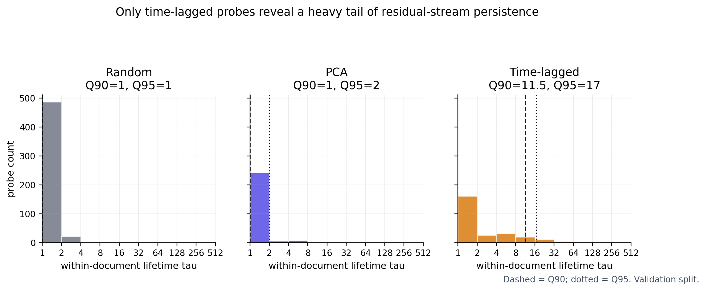{#fig-tau-histograms fig-align="center" width="100%"}



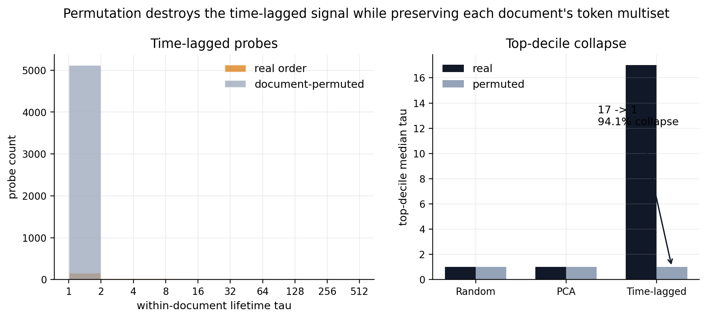{#fig-permutation-collapse fig-align="center" width="100%"}



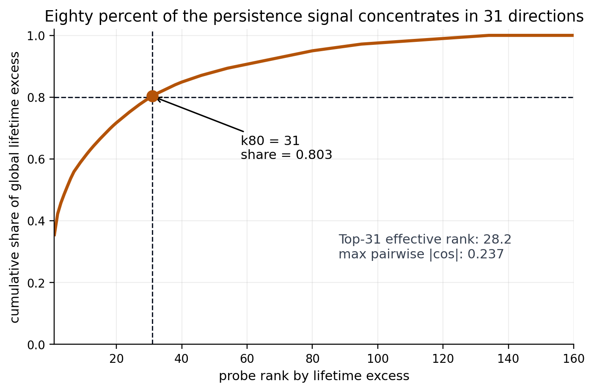{#fig-lifetime-excess fig-align="center" width="82%"}



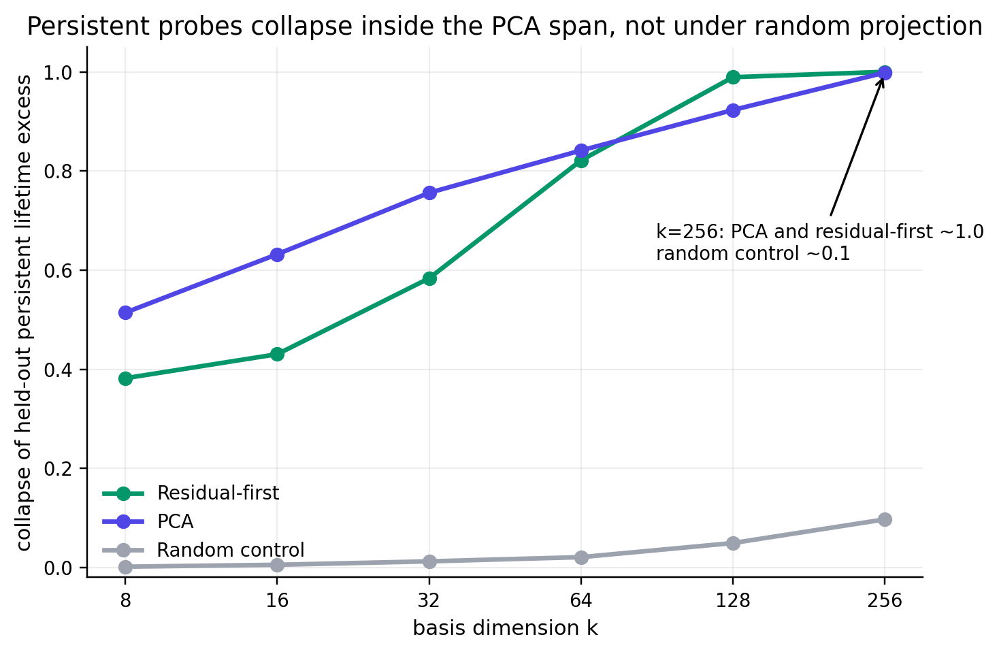{#fig-projection-collapse fig-align="center" width="82%"}

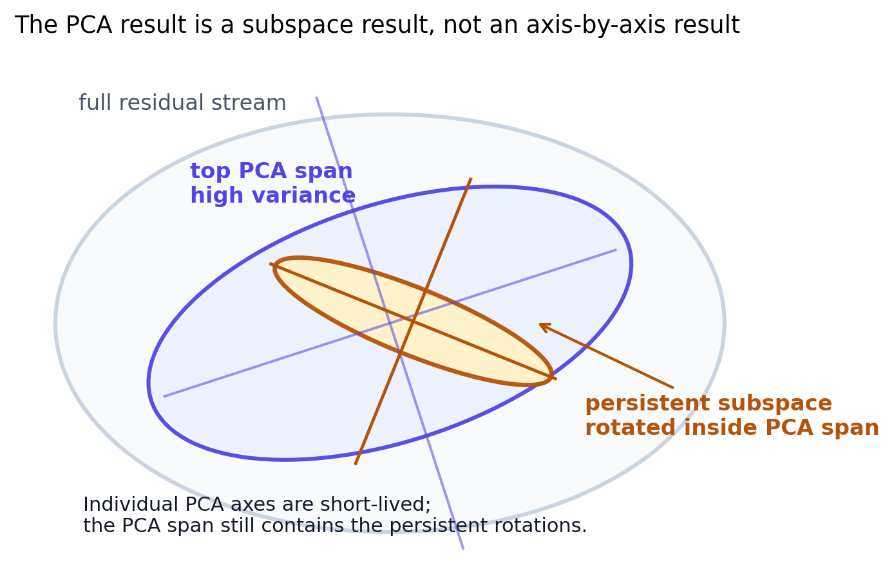{#fig-pca-schematic fig-align="center" width="76%"}



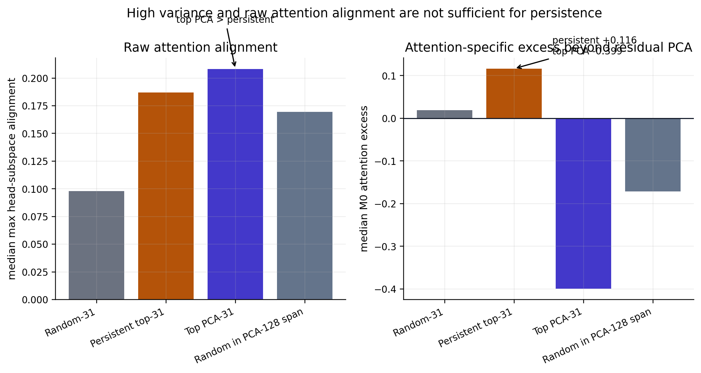{#fig-pca-vs-persistent fig-align="center" width="100%"}







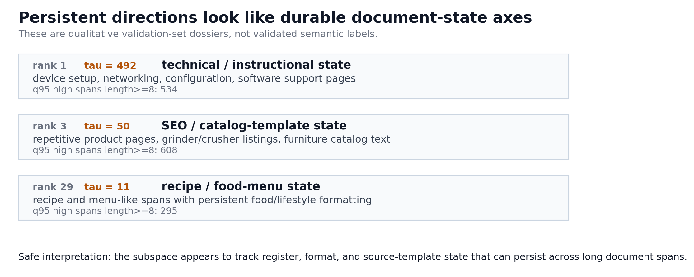{#fig-semantic-spans fig-align="center" width="100%"}





## Appendix figures

The appendix figures are supporting diagnostics for the main narrative. They are included here to keep the post auditable without overloading the main argument.

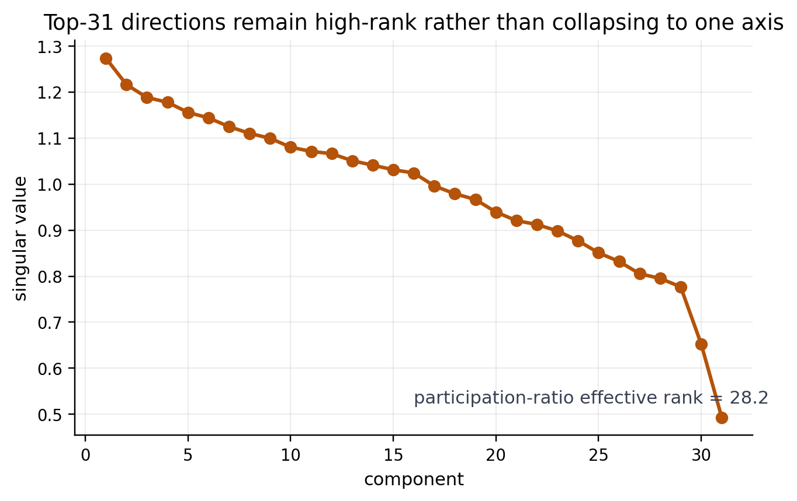{#fig-singular-spectrum fig-align="center" width="78%"}

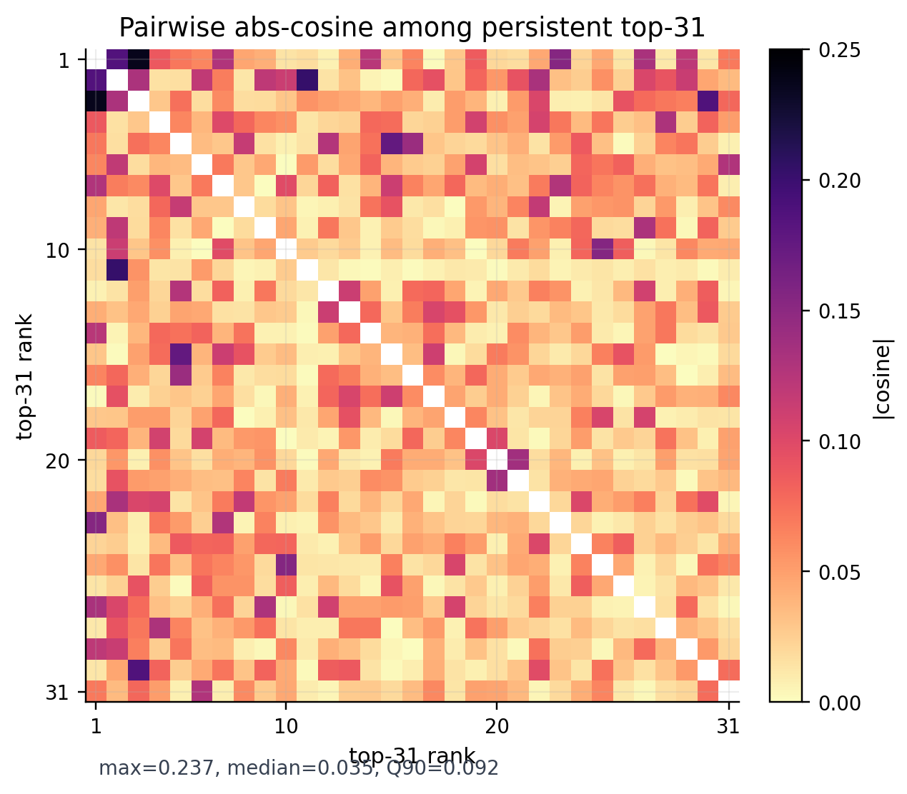{#fig-cosine-heatmap fig-align="center" width="70%"}

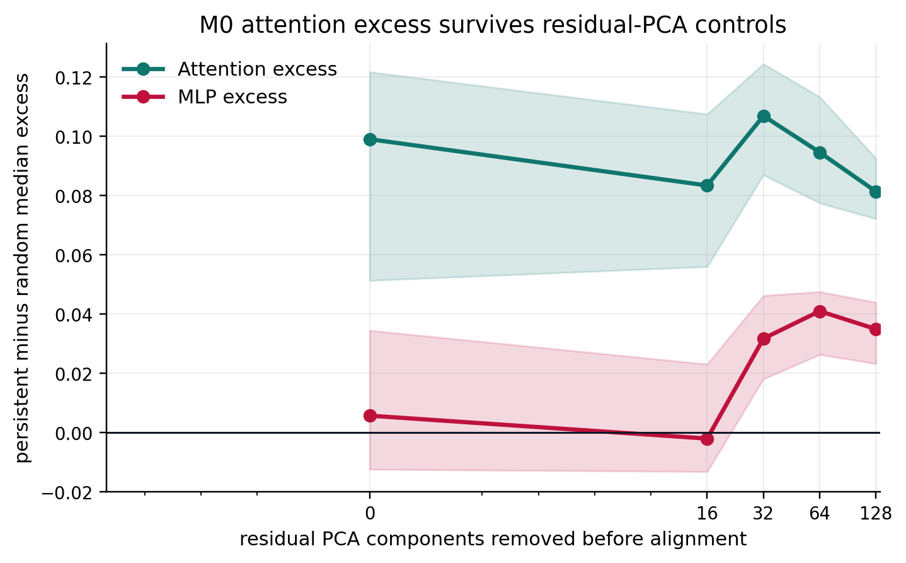{#fig-alignment-controls fig-align="center" width="82%"}

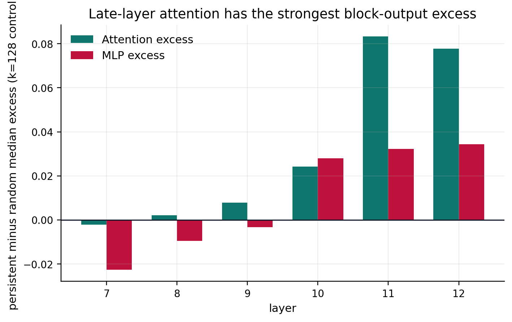{#fig-m0-by-layer fig-align="center" width="82%"}

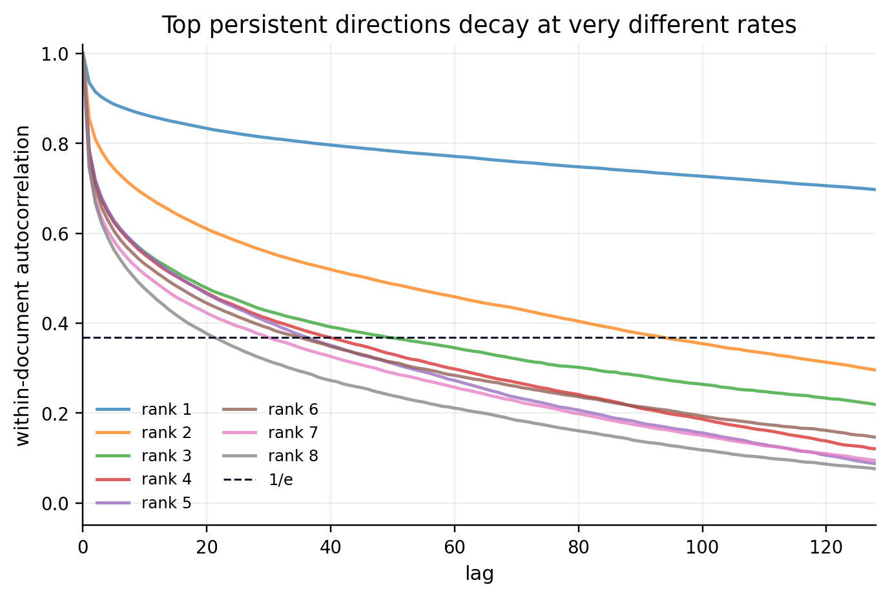{#fig-top-decay-curves fig-align="center" width="82%"}
