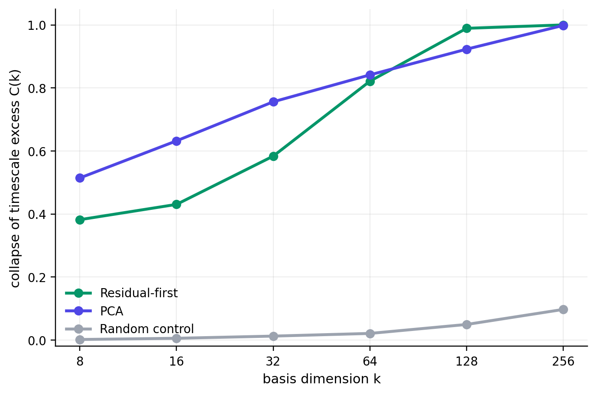
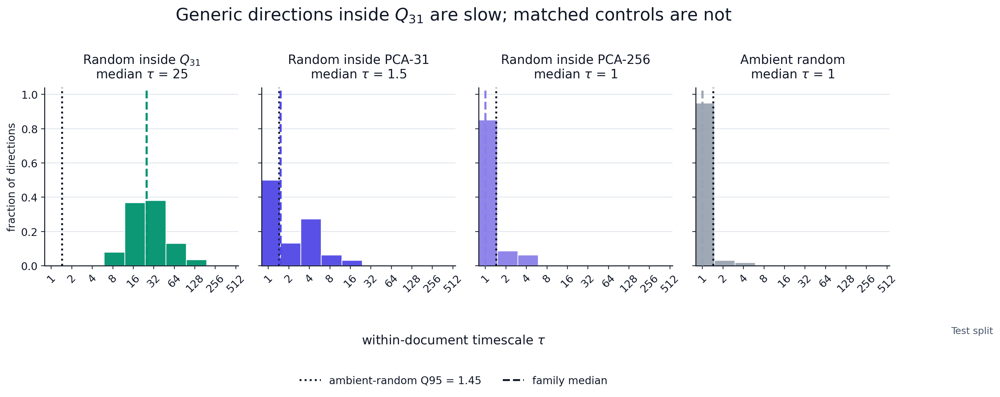
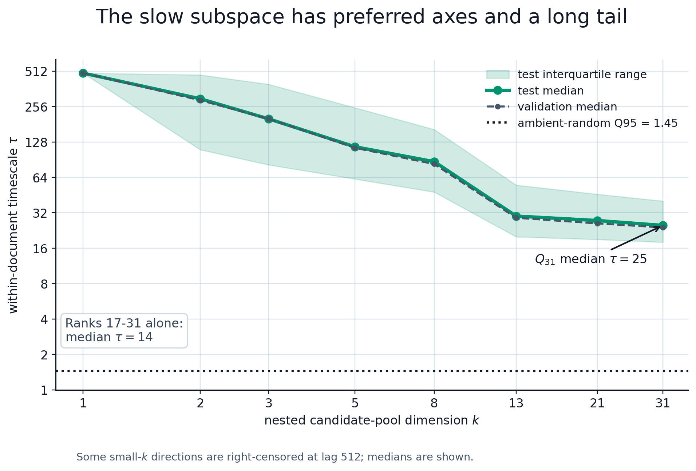

[Read the published post on LessWrong](https://www.lesswrong.com/posts/jkEnRkokmzvvKNzzB/the-residual-stream-has-a-geometry-of-time-1){.external-link} · [Open the standalone technical appendix](appendix.qmd){.secondary-link} · [Download the appendix as Word](../downloads/residual-stream-geometry-technical-appendix.docx){.secondary-link}

# Preface

This is a preliminary writeup for an experiment on residual stream geometry. The research direction seems pretty underexplored, so I’m posting early to collect objections, research intuitions, and connections to problems other people are thinking about before I invest in the larger run.

*The case for skimming this post:* this experiment suggests transformers may keep track of context in a surprisingly compact way. Directions whose residual-stream projections change slowly across many tokens are not diffuse across activation space; they concentrate in a low-dimensional subspace that can be projected out, compared to attention/MLP writes, and maybe even targeted by interventions.

The code for the experiment is available at this [public repo](https://github.com/Fodenthal/residual-geometry-experiment).

# Summary

- The residual stream is commonly analogized to the transformer's "working memory." At each token position, a high-dimensional vector accumulates the attention and MLP deltas. This picture considers state transformations along the depth-time axis, i.e. layer by layer.

- There is a second axis of sequence-time. Within a layer, the model must also keep track of information at position $t$ which is useful at position $t + k$. This experiment aims to discover the geometry of directions whose residual-stream projections remain correlated across many tokens.

- A direction's (sequence) timescale $\tau_j$ is the lag at which its sample autocorrelation first drops below $1/e \approx 0.37$. To calculate $\tau_j$ for direction $v_j$, I project the residual stream onto $\hat v_j$ at every token position, compute within-document autocorrelation curves, average them over documents to estimate lag-k autocorrelation $R_j(k)$, and set $\tau_j = \min\{k \geq 1 : R_j(k) < 1/e\}$.

- A high timescale means a direction's projected value changes slowly across long spans of tokens, but does not distinguish two mechanisms: each token independently recomputing a similar value, or a state value written once and read back at a later token for further computation.

- The primary experiment compares three probe families: 512 random directions (null baseline), 256 PCA directions (ranked by variance), and 256 time-lagged probes (multi-lag TICA style, ranked by persistence). Estimator details are in Appendix A.

- I estimated the distribution of timescales across residual-stream directions in layer 12 of Gemma-2-2B on 5,000 C4 documents, then investigated the properties of the high-$\tau$ directions: where they live in the ambient space, how many there are, what they appear to semantically encode, and whether their high timescales are tied to sequential context or just unigram statistics.

- **Findings preview:** most residual directions are fast, as their projected values stop being predictive after just one token. But a small set of directions is much slower. These slow directions are not just duplicates of each other, are heavily dependent on sequential context, and span a region where generic directions are slow. On C4, the cautious interpretation is that this region mostly tracks durable document state, not abstract reasoning variables.

# What Was Found

**Finding 1: The timescale distribution is extremely heavy-tailed, and the tail is carried by about 31 directions.** Random and PCA directions have a 90th-percentile timescale of 1 token, carrying essentially no signal across positions. Time-lagged probes have a 90th-percentile timescale of 17 tokens.


To quantify the tail, define a direction's timescale excess as its timescale above the random-direction median,

$$ \Delta \tau_j = \max\!\left(\tau_j - \operatorname{median}_{u \in \mathrm{random}}\tau_u,\ 0\right), $$

and sort the excesses $\Delta\tau_{(1)} \geq \cdots \geq \Delta\tau_{(1024)}$ across the deduplicated eligible probe set. Roughly 31 directions carry about 80% of the total excess, $\sum_{i=1}^{31}\Delta\tau_{(i)} / \sum_{i=1}^{1024}\Delta\tau_{(i)} \approx 0.8$. Also, the 31 directions are nonredundant, with low cosine sim and effective rank ~28/31, meaning the set behaves like roughly 28 independent directions rather than a few repeated ones (orthogonality details in Appendix E).

**Finding 2: Timescale depends on sequential order.** Shuffling token positions within documents, which preserves the token multiset but destroys sequential context, collapses the top-decile timescale of slow probes from 17 tokens to 1 (94% reduction). This rules out token composition alone, such as recurring token clusters, as the reason for high $\tau$.


## Where the slow directions live: held-out projection collapse

This section asks two things with one test: 1) where in the residual stream the slow directions live and 2) whether they are the only high-timescale region. If persistent structure lived outside these directions then removing them would leave some behind, so a full collapse of held-out timescales is evidence they carry essentially all of it.

I build three $k$-dimensional bases, project each out of the residual stream, and recompute timescales on held-out probes. The held-out probes are time-lagged directions fit on a disjoint train shard, have nearly identical timescale distribution as the original time-lagged probe set (Q90 around 19-20 versus 17) before projection, and are not eligible for the basis we project out (construction details are in Appendix B).



Projecting out the slow basis collapses persistence on held-out probes almost completely by $k=256$ ($C \approx 1.0$). Removing the same number of top-PCA directions collapses it just as completely, while removing 256 random directions barely touches it ($C \approx 0.10$).

**Finding 3: Persistence depends on the high-variance substrate.** PCA-256 explains 67% of residual variance, so it makes sense this heavy deletion collapses persistence. What is intersting is that the 31-dim slow basis is an equally effective deletion basis but is only 9% contained in PCA-31 and explains only 9% residual variance. In angle terms, the slow span is far from PCA-31 (median principal angle $81^\circ$), though more overlapping with PCA-256 (median principal angle $44^\circ$).

The resolution is from distinguishing where a slow direction's *energy* sits from where its *slowness* comes from-- it may have about half its energy outside PCA-256, but that isn't what makes it slow. PCA diagonalizes the zero-lag covariance, so its components are uncorrelated at lag 0, and empirically each one alone is fast (low $\tau$). But the lagged covariance isn't diagonal in that basis! The slow directions are combinations of PCA components whose lagged cross-covariances reinforce each other, keeping the combined signal correlated out to large k. So slowness is a relational property of how components co-vary across lags, not a marginal property of any single component (a more rigorous treatment is in Appendix F).

An intuitive image is that a single PCA axis is a note that fades at once, while a slow direction is a chord whose overtones ring on, living in how the notes combine rather than in the loudest among them. So deleting the slow directions removes a slowness ingredient many computations ride on, not an isolated module.

## Are just the directions slow, or do they span a slow subspace?

Finding 1 gave 31 slow axes, but the objective could have picked special directions while generic directions in their span remain fast (low $\tau$). To test this, I sample random unit vectors inside the slow span, matched PCA spans, and the ambient space, then measure held-out timescale with the same estimator. Method and full set of checks are in Appendix E.



| Subspace | Dim | Median $\tau$ | Fraction $\tau$ above ambient null |
|---|---:|---:|---:|
| Slow subspace | 31 | 25 | 1.00 |
| PCA-31 | 31 | 1.5 | 0.50 |
| PCA-128 | 128 | 1.0 | 0.29 |
| PCA-256 | 256 | 1.0 | 0.15 |
| Ambient | 2304 | 1.0 | n/a (defines null) |

*Test split, 512 sampled directions per subspace; ambient null = ambient-random Q95 timescale. Validation is near identical (slow subspace median $\tau = 24$ val). Slow-subspace lower-tail quantiles on test: q05 = 10, q25 = 18, q50 = 25, q75 = 40, q95 = 82.*

**Finding 4: There exists a slow subspace.** The median $\tau$ inside the slow span is 25, against 1 to 1.5 for matched-dimension PCA spans. Every sampled slow subspace direction beat the null while at least half of the PCA-control directions fell inside it, so there is no obvious "fast corner" of the slow subspace. The caveat is that 512 samples can support a claim about generic directions pretty well, but not a proof that every direction in the continuous span is slow.

But the subspace is not uniformly slow. Sweeping its dimension reveals a steep internal gradient.




Intuitively, a wider span includes increasingly fast directions, so a random vector places less of its energy on the slowest modes. Also note that the tail is independently slow, as a random mix of only the bottom-ranked directions (ranks 17 to 31) still has median $\tau = 14$. The sweep falls off steeply because the 31 directions span roughly 28 distinct geometric dims (geometric participation ratio 28) but concentrate their persistence into roughly five modes (slowness participation ratio 5).

| Span | Median $\tau$ |
|---|---:|
| top-1 | 492 |
| top-2 | 298 |
| top-3 | 201 |
| top-5 | 116 |
| top-8 | 87 |
| top-13 | 30 |
| top-21 | 27.5 |
| top-31 (full span) | 25 |
| ranks 17-31 only | 14 |

*Test split; validation tracks within a token or two.*

The structure is stable across splits (Spearman above $0.99$ between all split pairs, $0.996$ for random-in-span across validation and test, no train-to-test shrinkage). Full split-stability table and the test-inspection disclosure are in Appendix E.

## Attention-aligned geometry (exploratory)

**Finding 5: The slow directions align with attention-output geometry.** What in the model creates the slow directions? The natural hypothesis is that attention writes/maintains them, as it is the model's only mechanism for mixing information across positions.

However, raw overlap with attention outputs is a confounded test. Since attention writes into the residual stream, which is dominated by a few top PCA axes, any two subspaces drawn from it overlap by default. I measure each direction's overlap with the attention and MLP output subspaces and subtract its overlap with a matched-dimension PCA subspace to control for this.

For a unit direction $v$ and a subspace projection matrix $P$, the overlap score is $B_P(v) = \|Pv\|_2$, and the excess attention and MLP overlaps are:

$$ E_{\mathrm{attn}}(v) = B_{\mathrm{attn}}(v) - B_{\mathrm{resid}}(v), \qquad E_{\mathrm{MLP}}(v) = B_{\mathrm{MLP}}(v) - B_{\mathrm{resid}}(v). $$


*The curves show the selected-slow-direction minus random-direction median excess as progressively more PCA components are removed. Discussed more in Appendix C.*

The slow directions have positive excess attention overlap, with median $+0.1164$. The score is unitless and only means something against a baseline: random directions sit at $0.0206$ (SD $0.0166$), which means the slow directions are about $5.8$ SDs above the random mean.

$$ \frac{0.1164 - 0.0206}{0.0166} \approx 5.76. $$

Overall, this test finds that long-timescale directions lie unusually close to attention output subspaces, with weaker evidence for late-MLP overlap. It doesn't prove that attention causally maintains state in the slow subspace.

## What the directions encode (exploratory)

The goal is to characterize what the slow subspace carries, but the trap is that top-token labels are nearly free. Regardless of timescale, any direction yields a plausible story from its top tokens. Instead, for each direction I look for long, high-projection runs on the validation split and count how many distinct documents contain at least one, so a single page can't drive the result. Details are in Appendix D.

The contrast is large. A generic rotation inside the slow subspace has a median qualifying run of 126/500 val docs, and still 106 at the Q10. The matched controls collapse, as random PCA-31 has median 18 docs and sub-5 at 10th percentile, while PCA-128, PCA-256, and ambient-random are in the low single digits.


The cautious verdict is that on C4 the slow subspace mostly tracks durable web-document state, including register, domain, formatting, source templates, and scraping artifacts. That is not yet evidence for clean semantic features or abstract reasoning variables. These directions behave like held state, lit steadily over a coherent passage, rather than higher-level variables updated during reasoning, and separating those two cases needs new experiments (see below).

Limitations of this section:

- Inspects ten samples per span family, on validation only.
- Labels are coarse: they are regex summaries of the highest and lowest projection token windows.
- Some directions visibly track scraped-source or formatting structure, not semantics.

# What This Result Means So Far

This experiment used one corpus, layer, and model, so it doesn't license any broad interpretability claims.

Currently, the contribution is the axis itself. Timescale ranks directions by what stays correlated across positions, a question sidestepped by the major decomp methods: PCA ranks directions by variance, SAEs find sparse features at single positions, and parameter decomp describes static weight structure. None of these directly answer what stays correlated across time.

On generalization, my prior is that a slow subspace is roughly model-general but its orientation is corpus-dependent. Persistent state has to live somewhere but the residual stream is too anisotropic for it to spread evenly, so some compact slow geometry should recur.

# Continuations: What I Want to De-risk

A high-$\tau$ direction is likely one of two things. **1) Held state:** the value sits at a steady level over a passage and varies between passages, e.g. what C4 appears to surface. **2) Live variable:** the value changes over the passage while staying readable from the same direction, like a count, proof state, or intermediate conclusion. The second case is the LRH with dynamics: we still have variables that correspond to fixed directions, but the scalar value is updated over sequence-time.

Concrete experimental continuation:

1. **A corpus that forces the distinction.** Multi-step proofs, long-horizon code, or controlled reasoning tasks with a labeled running variable. Will also add sentence-level shuffling and paraphrase controls to cut the local lexical clustering that C4 leaves in.

2. **A direct held vs. live discriminator.** Regress each slow direction's within-document projection against the labeled quantity. If it tracks a document-level constant, it is held state. But if it tracks the running value, the slow subspace likely carries a live variable.

The interpretability payoff depends on which world that test lands in. If the slow subspace is only web-document register, timescale is less exciting. If it carries maintained reasoning variables, then some really interesting questions become askable: whether a steering vector shifts maintained state or just "greases the logits," whether features decompose into fast and slow components, whether sparse-feature methods could be run not over the whole activation space but constrained to the high-timescale region.

# Appendices

## Appendix A: Time-lagged probe estimator

Let $r_{d,t}^{(\ell)} \in \mathbb{R}^{d_{\mathrm{model}}}$ be the residual stream for document $d$, token $t$, and hook layer $\ell$. Train-token centering uses

$$ \mu = \mathbb{E}_{d,t \in \mathrm{train}}[r_{d,t}^{(\ell)}], \qquad \bar r_{d,t} = r_{d,t}^{(\ell)} - \mu. $$

Validation/test tokens are not used to fit PCA directions, time-lagged probes, or centering statistics.

### Timescale estimator

For a unit probe $\hat v_j$,

$$ P_{d,t,j} = \hat v_j^\top r_{d,t}^{(\ell)}. $$

Within-document demeaning:

$$ \tilde P_{d,t,j} = P_{d,t,j} - \frac{1}{T} \sum_{u=0}^{T-1} P_{d,u,j}. $$

Per-document lag-$k$ autocorrelation:

$$ r_{j,d}(k) = \operatorname{corr} \left( \tilde P_{d,0:T-k,j}, \tilde P_{d,k:T,j} \right). $$

Probe-level curve, with equal document weighting:

$$ R_j(k) = \frac{1}{|\mathcal D_{j,k}|} \sum_{d \in \mathcal D_{j,k}} r_{j,d}(k), $$

where $\mathcal D_{j,k}$ excludes document/probe/lag entries with near-zero lag-slice variance. Pilot requires $|\mathcal D_{j,k}| \geq 100$.

I smooth $R_j(k)$ with a centered moving average of width 5 for $k \geq 1$, set $R_j(0)=1$, and clip to $[-1,1]$. The reported timescale is

$$ \tau_j = \min\{k \geq 1 : R_j(k) < 1/e\}. $$

If no crossing occurs by $K=512$, the probe is marked right-censored. In this pilot, no non-random probes were right-censored.

### Time-lagged probe fitting

The time-lagged probes are fit on train documents only. Estimate

$$ \Sigma_0 = \mathbb{E}[\bar r_t \bar r_t^\top], \qquad \Sigma_k = \mathbb{E}[\bar r_t \bar r_{t+k}^\top]. $$

Use the symmetrized multi-lag covariance

$$ \Sigma_{\mathrm{lag}} = \sum_{k \in \{8,16,32,64,128\}} \frac{\Sigma_k+\Sigma_k^\top}{2}. $$

Time-lagged probes are the leading generalized eigenvectors of

$$ \Sigma_{\mathrm{lag}} v = \lambda(\Sigma_0+\epsilon I)v, $$

Conceptually, this maximizes a direction's multi-lag self-predictiveness, $\frac{v^\top \Sigma_{\mathrm{lag}} v}{v^\top(\Sigma_0+\epsilon I)v}$: the numerator rewards covariance with future positions, while the denominator prevents the estimator from merely selecting high-variance directions.

with

$$ \epsilon = 10^{-4} \frac{\operatorname{tr}(\Sigma_0)}{d_{\mathrm{model}}}. $$

If $\operatorname{cond}(\Sigma_0+\epsilon I)>10^4$, $\epsilon$ is doubled until the condition number falls below $10^4$, up to $10^{-1}\operatorname{tr}(\Sigma_0)/d_{\mathrm{model}}$.

The covariance objective chooses candidate directions; the held-out $1/e$ autocorrelation crossing defines the reported timescale. All reported $\tau$ values use this same within-document estimator. Their scale differs because they summarize different probe sets: the headline Q90 of 17 is computed across the original time-lagged probes, while the subspace battery in Appendix E samples rotations within the selected $Q_{31}$ span and nested prefixes concentrated on its slowest directions.

This objective has standard precedents. It is closely related to [slow feature analysis](https://doi.org/10.1162/089976602317318938) (Wiskott and Sejnowski, 2002) and to [time-lagged independent component analysis](https://doi.org/10.1063/1.4811489) (Perez-Hernandez et al., 2013), which extracts slow collective coordinates through a lagged-covariance generalized eigenproblem. TICA has a variational interpretation in terms of slow transfer-operator modes, making operator language a useful analogy. I use the narrower claim here: this probe fit surfaces slow linear residual-stream modes; it is not a full Koopman or dynamic-mode-decomposition analysis.

Fit health:

| Diagnostic | Value |
|---|---:|
| Lagged pair count | 19,488,000 |
| Train token count | 4,096,000 |
| Whitening PCs requested / used | 512 / 512 |
| Initial epsilon | 0.00034823549316734574 |
| Ridge doublings | 0 |
| Final condition number | 147.78 |
| Fit unstable | false |
| Anti-persistent or sign-changing count | 0 |

Top generalized eigenvalues:

```text
0.9082, 0.8654, 0.8534, 0.8218, 0.7620, 0.7357,
0.7230, 0.6835, 0.6419, 0.6071, 0.5948, 0.5680
```

### Split hygiene

- Train documents are used to fit directions and centering.
- Validation/test documents are used to estimate $R_j(k)$ and $\tau_j$.
- Independent held-out lag probes are used for projection-collapse evaluation.

## Appendix B: Held-out projection-collapse method

Let $G_k$ be the top-$k$ eligible residual probes ranked by held-out within-document timescale after deduplication. I orthonormalize these directions to obtain a slow-direction basis $Q_k$.

For each residual vector, I remove the component in this basis:

$$ r^{\perp k}_{d,t} = r_{d,t} - Q_kQ_k^\top r_{d,t}. $$

I then recompute held-out probe projections,

$$ P^{\perp k}_{d,t,j} = v_j^\top r^{\perp k}_{d,t}, $$

and re-estimate the same within-document autocorrelation timescale $\tau_j$ used in the main analysis.

The held-out evaluation probes are fixed before projection-collapse evaluation:

- $J_{\mathrm{random}}$: fresh random unit directions, independent of the random probes eligible for $G_k$;
- $J_{\mathrm{lag\text{-}heldout}}$: independently fit time-lagged probes, fit on disjoint train documents from the candidate time-lagged probes and never eligible for $G_k$.

The candidate time-lagged probes used to construct $G_k$ are fit on train shard A. The held-out time-lagged evaluation probes are fit on train shard B. Both are evaluated on the same validation/test documents. This makes the test non-circular: the evaluation probes are not used to construct the projected basis, but their before/after timescales are measured on the same held-out documents.

### Projection-collapse split details

The corpus contained 5,000 C4 documents of length 1,024 tokens:

| Bucket | Documents | Tokens |
|---|---:|---:|
| Full train split | 4,000 | 4,096,000 |
| Train shard A | 3,200 | 3,276,800 |
| Train shard B | 800 | 819,200 |
| Validation | 500 | 512,000 |
| Test | 500 | 512,000 |

For the projection-collapse analysis, the train split was further partitioned using a held-out train fraction of 0.2. Candidate time-lagged probes used to construct the projected basis were fit on train shard A. The 128 held-out time-lagged evaluation probes, $J_{\mathrm{lag\text{-}heldout}}$, were independently fit on train shard B and were never eligible for the projected basis.

Projection collapse was evaluated on validation during development and then confirmed on the test split using the same fixed probes and bases. No candidate probes, held-out probes, or projected bases were refit for the test confirmation.

For each held-out evaluation family $J_\star$, the collapse score is

$$ C(k) = 1 - \frac{ \operatorname{median}_{j \in J_\star} [ \tau_j(r^{\perp k}) ] }{ \operatorname{median}_{j \in J_\star} [ \tau_j(r) ] }. $$

I compute $C(k)$ for three matched bases:

1. the slow-direction basis;
2. the top residual PCA basis;
3. a random orthonormal control basis.

The random-control basis tests whether collapse is caused merely by deleting any $k$ dimensions. The PCA basis tests whether held-out persistence functionally depends on high-variance residual geometry.

## Appendix C: Scale calibration for unitless overlap scores

For unitless overlap/excess scores $S(v)$, I report scale relative to matched random residual directions:

$$ \mu_{\mathrm{rand}} = \operatorname{mean}_{v \in \mathrm{random}} S(v), \qquad \sigma_{\mathrm{rand}} = \operatorname{sd}_{v \in \mathrm{random}} S(v), $$

$$ z_{\mathrm{rand}}(S) = \frac{S_{\mathrm{group}}-\mu_{\mathrm{rand}}}{\sigma_{\mathrm{rand}}}. $$

This is a scale calibration, not a Gaussian significance test.

For the attention-overlap result in Finding 5, $S = E_{\mathrm{attn}}$. The reported slow-direction value, $+0.1164$, is the median over the 31 selected slow directions. The random baseline uses the matched random residual directions: mean $0.0206$, standard deviation $0.0166$. Thus the slow-direction median is $5.76$ random-control SDs above the random mean.

This is a descriptive scale calibration, not a p-value. The 31 slow directions were selected by the pipeline and are not IID samples from a null distribution, so the calculation should be read as "large on the random-direction scale," not as a Gaussian-significance claim.

The residual-PCA subtraction is useful for controlling residual-stream anisotropy, but it should not be read literally for PCA axes themselves. Top PCA directions have higher raw attention overlap than the slow directions, but median $\tau = 1$. After subtracting the matched residual-PCA baseline, their median excess attention overlap is $-0.3991$, about $25$ control SDs below the random mean. This does not mean PCA directions are "anti-attention"; their residual-PCA baseline is mechanically large because they are PCA axes. The point is just that raw attention overlap is not the signal.

## Appendix D: Supervised semantic audit

This was a separate supervised characterization experiment on the already-frozen slow-31 subspace; it did not refit the slow geometry. I used Gemma-2-2B layer 12 `hook_resid_post` on 1,200 C4 documents split into 800 fit, 200 validation, and 200 sealed test documents. Each document had context length 1,024, with residuals sampled at 12 token positions from 256 through 960, giving a captured tensor of shape $1200 \times 12 \times 2304$. Labels were frozen before residual activations were captured. The planned Gemma-2-2B-IT labeler was unavailable, so the labeling model was prospectively switched to pinned Gemma-2-9B-IT before inspecting activations or results; the prompt, ontology, and abstention rule were unchanged.

The targets were document topic and register. The realized topic ontology was coarse because `other_or_unclear` accounted for 899 of 1,200 documents. Retaining only classes with at least 30 fit documents left `business_and_finance`, `home_food_and_lifestyle`, and `other_or_unclear`; the sealed topic analysis therefore used 169 of 200 test documents.

For every sampled activation, I compared the frozen slow-31 coordinates with equal-rank PCA-31 and 20 frozen random rank-31 controls sampled inside a fit-only PCA-256 span. The classifier tested incremental information rather than raw decodability. Its nuisance representation contained token position, token-derived features, and a 32-dimensional PCA compression of local-window mean embeddings. For a candidate subspace $S$, the semantic gain was

$$ G_S = CE(\text{nuisance only}) - CE(\text{nuisance}+S), $$

in nats per example. Positive gain means that $S$ improves held-out prediction beyond the local-context baseline. Inference was document-weighted, used 1,000 paired document-bootstrap replicates, and accessed the sealed test set once.

### Sealed topic result

| Representation | Cross-entropy gain |
|---|---:|
| Slow-31 | 0.03337 nats |
| PCA-31 | 0.01733 |
| Random-31 median | 0.00970 |
| Random-31 Q95 | 0.01575 |
| Best of 20 random controls | 0.01661 |

Slow-31 beat all 20 frozen random controls, provided about $1.93\times$ the gain of PCA-31, and exceeded the prespecified 0.01-nat effect-health reference. The paired bootstrap estimates were:

| Quantity | Estimate | 95% confidence interval |
|---|---:|---:|
| $G_{\mathrm{slow}}$ | 0.03315 | [0.01335, 0.05595] |
| $G_{\mathrm{slow}}-G_{\mathrm{random,med}}$ | 0.02377 | [0.01270, 0.03628] |
| $G_{\mathrm{slow}}-G_{\mathrm{PCA}}$ | 0.01586 | [0.00475, 0.02743] |

All three lower bounds were positive. Register was inconclusive: the raw sealed-test gains were 0.00946 for Slow-31, 0.00637 for PCA-31, and 0.00158 for the random median, but every relevant bootstrap interval crossed zero.

The topic result was not explained by residual energy. Projected fit energy was approximately 15.4 for Slow-31, 28–33 for the random controls, and 138–139 for PCA-31. Slow-31 therefore predicted topic better while capturing substantially less activation energy. The random controls were rank-matched but were not explicitly energy-matched.

### Internal semantic geometry

Because topic passed the first gate, I tested how many supervised directions within Slow-31 were needed for the readout. Validation gains at semantic ranks $r \in \{1,2,4,8\}$ were 0.0140, 0.0257, 0.0257, and 0.0257 nats, respectively. Rank 2 was the smallest rank retaining at least 90% of the full slow-space topic gain. Since a three-class multinomial readout has at most two independent class-contrast dimensions, low rank alone is not strong evidence. I therefore fit the rank-2 semantic span independently on two document-disjoint halves and measured mean squared canonical correlation. The observed overlap was 0.4546, versus a median of 0.0644, Q95 of 0.1981, and maximum of 0.2465 across 50 document-label-shuffle refits. None of the shuffled controls reached the observed overlap; the plus-one empirical $p$-value was approximately 0.0196. Thus the orientation of the two-dimensional topic readout reproduced across independent document splits.

## Appendix E: Slow-subspace battery

This appendix details the diagnostics behind Finding 4. All quantities are evaluated on held-out validation and test documents using the timescale estimator of Appendix A. The battery operates on saved projection artifacts; it performs no additional model forward pass or probe refit beyond the sampling described here.

**Random-in-span sampling.** Let $Q_{31}$ be the orthonormalized basis of the 31 directions from Finding 1. More generally, for a $k$-dimensional subspace with orthonormal basis $Q_k$, I sample coefficients

$$ z \sim \mathcal{N}(0, I_k) $$

and form

$$ u = Q_k \frac{z}{\|z\|_2}. $$

This gives a uniformly random unit direction inside the subspace. I then compute the same held-out within-document autocorrelation timescale $\tau$ for each sampled direction.

**Matched controls.** The same procedure is applied to the top-$k$ PCA subspaces for $k \in \{31, 128, 256\}$ and to the full ambient space. The PCA-31 control is the critical matched-dimensional comparator: it tests whether selecting the same number of highest-variance residual axes is enough to recover a generically slow subspace. PCA-128 and PCA-256 test whether random rotations become slow merely by drawing them from progressively broader high-variance residual geometry.

**Subspace-PCA geometry.** Principal-angle and energy statistics between the 31-dimensional slow basis $Q_{31}$ and the top-$k$ PCA subspaces (artifact-only; no rerun). Mean squared containment is the fraction of $Q_{31}$ energy captured by the PCA subspace, $\|P_{\mathrm{PCA},k}Q_{31}\|_F^2 / 31$; effective overlap is the unnormalized numerator, with units of dimensions.

| Comparison | Mean squared containment | Effective overlap $\sum_i\cos^2\theta_i$ | Median principal angle | Worst angle |
|---|---:|---:|---:|---:|
| $Q_{31}$ vs PCA-31 | 8.99% | 2.79 / 31 | 81.1° | 90.0° |
| $Q_{31}$ vs PCA-128 | 28.69% | 8.89 / 31 | - | - |
| $Q_{31}$ vs PCA-256 | 52.06% | 16.14 / 31 | 44.2° | 62.8° |

The 31 directions are also near-orthogonal to each other: median pairwise absolute cosine is $0.035$, against a random-direction baseline of $\operatorname{sd}(\langle u,v\rangle) = 1/\sqrt{2304} \approx 0.0208$ for independent unit vectors in $\mathbb{R}^{2304}$, so the observed median is only about 1.7x the random-cosine SD. This is the within-set redundancy check; effective rank is about 28 of 31.

There is one exact shared direction (PC-1). Removing it, the remaining 30-dimensional slow rotation sits at a median principal angle of 81.6° from PCA axes 2-31. The slow-basis energy is spread broadly across the PCA spectrum:

| PCA band | Fraction of $Q_{31}$ energy |
|---|---:|
| PC 1 | 3.2% |
| PCs 2-31 | 5.8% |
| PCs 32-64 | 7.1% |
| PCs 65-128 | 12.6% |
| PCs 129-256 | 23.4% |
| Outside PCA-256 | 47.9% |

It takes 246 PCA axes to capture 50% of the slow-basis norm, and excluding PC-1 the captured energy is nearly uniform across PCs 2-256. So the slow subspace is not unusually repelled from PCA-31; it is a diffuse rotation across a broad high-variance substrate that the leading PCA frame does not recover. As an exploratory statistic, among the selected source axes slower directions have more energy captured by PCA-256 (Spearman $\approx 0.90$, even excluding PC-1).

**Classification rule (pre-registered).** The slow subspace is classified "fat" when the median random-in-span $\tau$ exceeds the ambient-random Q90 null. The result is fat: median random-in-span $\tau = 24$ (val), $25$ (test) against an ambient null of $1$. The stronger "coordinate-free" claim, that essentially every direction in the span is slow, was not certified by this rule, because the locked rule tests only the median. The lower-tail analysis below is the empirical strengthening toward that stronger statement, but it is reported as exploratory rather than as a locked result.

**Nested dimension sweep.** Random-in-span sampling is repeated restricted to the top-$k$ directions for $k \in \{1, 2, 3, 5, 8, 13, 21, 31\}$. Median $\tau$ declines with $k$ ($492$, $298$, $201$, $116$, $87$, $30$, $27.5$, $25$ on test). The decline is partly mechanical, since a larger span admits progressively less-slow directions. The two non-mechanical observations are that the floor at $k=31$ ($\tau=25$) stays far above the null, and that random mixes of only ranks 17 to 31 retain median $\tau = 14$ (val $13$).

**Participation ratios.** For the 31 directions I report two ratios using the participation-ratio functional $(\sum_i x_i)^2 / \sum_i x_i^2$. Applied to the covariance eigenvalues of the direction set it gives the geometric participation ratio, $28.2$, confirming near-orthogonality and close-to-full rank. Applied to the timescale-excess values $\Delta\tau_i$ it gives the slowness participation ratio, $4.7$, quantifying that persistence concentrates into roughly five effective dimensions despite the high geometric rank.

**Lower-tail analysis.** With a 5000-replicate direction bootstrap, the fraction of the 512 random-in-span directions exceeding the ambient Q95 null is $1.0$, with quantiles q05 = $10$, q25 = $18$, q50 = $25$, q75 = $40$, q95 = $82$ (test). Matched controls: random PCA-31 has 50% above the null, PCA-128 has 29%, PCA-256 has 15%. The bootstrap characterizes Monte Carlo uncertainty over the already-sampled directions and does not substitute for a fresh prospective split.

**Split stability.** The 31 selected directions have median $\tau$ of $17$ (train), $16$ (val), $17$ (test), with Spearman correlations of $0.99$ across all split pairs and a train-to-test median shrinkage ratio of $1.0$. The random-in-span endpoint reproduces across val and test with Spearman $0.996$ and median absolute $\tau$ change of 1, with the fraction above the per-split null equal to $1.0$ on both. This rules out the shrinkage regime in which directions are slow on the fit shard and regress to the null on held-out data.

**Disclosure.** The test split had been inspected elsewhere in the workflow before the battery rule was locked, so test results are formally exploratory. Validation is the independent held-out reference and tells the same story.

## Appendix F: Why slowness is an off-diagonal property

Write a slow direction in the full PCA basis,

$$ v = \sum_i a_i u_i, $$

where $u_i$ are the PCA axes and $a_i^2$ is its energy on component $i$. Its lag-$k$ autocovariance is

$$ v^\top \Sigma_k v = \sum_i a_i^2\, c_{ii}(k) + \sum_{i \neq j} a_i a_j\, c_{ij}(k), $$

where $c_{ij}(k)$ is the lag-$k$ cross-covariance of PCA components $i$ and $j$.

PCA diagonalizes $\Sigma_0$, so the components are uncorrelated at lag 0. Empirically, the diagonal terms $c_{ii}(k)$ also decay quickly: individual PCA axes are fast. The lagged covariance is not diagonal in the PCA basis, so the off-diagonal terms $c_{ij}(k)$ can matter. The time-lagged objective selects combinations of PCA components whose cross-lag terms reinforce, keeping $v^\top \Sigma_k v$ large out to large $k$ relative to the variance $v^\top \Sigma_0 v$. Slowness is therefore an off-diagonal property of how components co-vary across lags, not a property of any single PCA component.

This also explains how PCA-256 and the slow basis can both be effective deletion bases without being the same object. PCA-256 does not contain the slow basis: it captures about half of its energy, while the rest lies outside PCA-256. But the collapse result suggests that the lagged structure needed for persistence depends strongly on this broad high-variance substrate. Projecting out PCA-256 removes enough of the shared components to break the reinforcing cross-lag combinations; projecting out the slow basis removes those combinations more directly.

Identity is not symmetric. PCA-256 contains no individually slow axis: each PCA axis has $\tau \approx 1$. The slow basis is the particular orientation in which components combine into long-timescale directions. One is an efficient remover of slowness that is itself fast; the other is slow.
